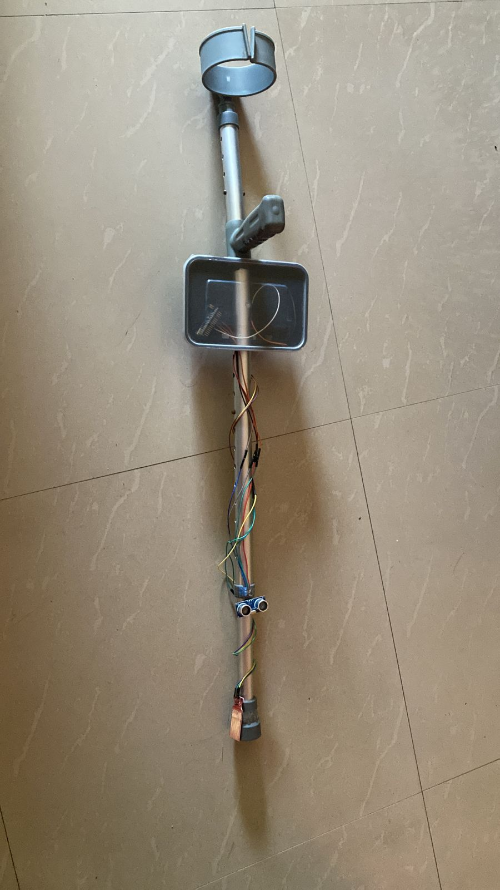
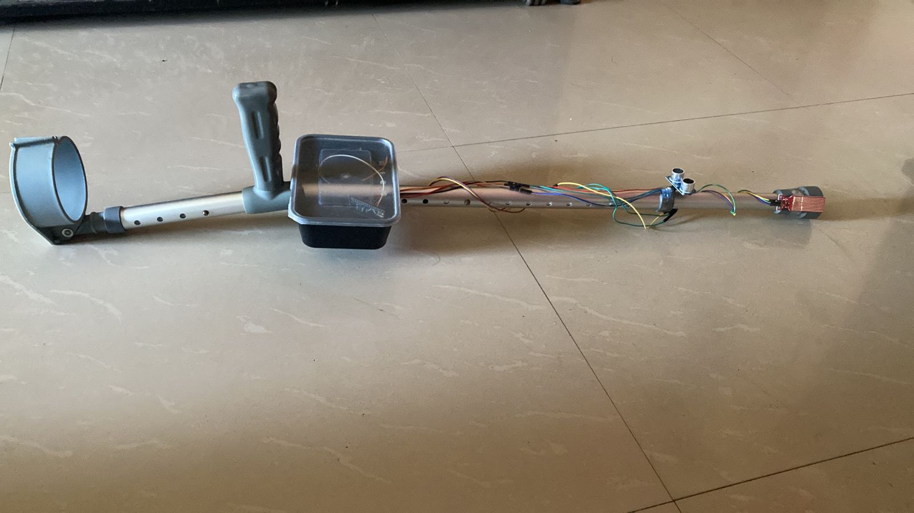

## Authors

- Ramiz Shaikh
- Daksh V. Meshram
- Amol Nagaonkar

---

# Smart Blind Stick

An **assistive technology device** designed to enhance the mobility, safety, and independence of visually impaired individuals.  
The Smart Blind Stick integrates **ultrasonic, infrared, and water sensors** along with **GPS modules** to detect obstacles, identify hazards, and track location in real time.

---

## Abstract

The Smart Blind Stick uses ultrasonic sensors to detect obstacles ahead and alert the user through **buzzer**.  
Additional features include:
- **Water detection** to identify wet/slippery surfaces.
- **GPS tracking** for real-time location monitoring.
- **Wi-Fi module (ESP8266)** for sending location data to a web interface.

By combining **hardware sensors** with **Arduino microcontrollers**, the stick provides real-time guidance and location awareness, reducing risks for visually impaired individuals.

---

## Objectives

- Develop a **portable and affordable** navigation aid for the visually impaired.
- Detect **obstacles, stairs, and holes** in real-time.
- Provide **location tracking** in emergencies.
- Enhance **user independence** in both indoor and outdoor environments.

---

## Hardware Components

| Component          | Function |
|--------------------|----------|
| **Arduino Nano**   | Main microcontroller for sensor data processing |
| **ESP8266**        | Wi-Fi communication and GPS data handling |
| **NEO-6M GPS Module** | Real-time location tracking |
| **Ultrasonic Sensor** | Detects obstacles within range |
| **Water Sensor**      | Detects water or wet surfaces |
| **Buzzer**            | Provides auditory alerts |
| **Battery**           | Powers the device |

---

## Software & Algorithms

### 1. **Obstacle Detection**
- Reads distance from ultrasonic & infrared sensors.
- If within a danger threshold, activates buzzer.

### 2. **Water Detection**
- Reads water sensor value.
- If above threshold, activates buzzer.

### 3. **GPS Tracking**
- NEO-6M GPS module sends location data to ESP8266.
- Displays latitude, longitude, date, and time on a web server.
- Google Maps link provided for quick navigation.

---

## System Architecture

1. **Sensors** → Detect environmental data.
2. **Arduino Nano** → Processes sensor inputs and triggers alerts.
3. **ESP8266 + GPS** → Tracks and transmits location.
4. **User Alerts** → Buzzer.

---

## Features

- Obstacle detection up to **4 meters**  
- Water hazard detection  
- GPS location sharing with **Google Maps link** 
- Lightweight and portable design  

---

## Project Images & Video

   
  <em>Electronic Blind Stick Front View</em>

   
  <em>Electronic Blind Stick Side View</em>

  <em>Click here to watch the video</em> 
  <a href="https://youtube.com/shorts/C-1TFMKYI50?si=itNjzB3EHT1RQFeD">
    ▶ Watch Video
  </a>

---

## Future Scope

- Add **voice guidance system** for enhanced navigation.
- Increase sensor range & add **LiDAR** for improved detection.
- Integrate with a **mobile application** for real-time alerts.
- Improve battery efficiency.

---

## Research Publication

This project is backed by our published IEEE paper:  

> **Title:** *Electronic Blind Stick*  
> **Conference:** International Journal of Scientific Research in Engineering and Management (IJSREM)  
> **Year:** 1 January 2025  
> **DOI:** https://www.doi.org/10.55041/IJSREM40484

[Download the IEEE Paper](https://ijsrem.com/download/electronic-blind-stick/)

---

### **Hardware Setup**
1. Connect sensors to **Arduino Nano** pins as per the circuit diagram.
2. Connect GPS module to **ESP8266** via serial communication.
3. Power the system using a 9V battery.

### **Software Setup**
1. Install **Arduino IDE**.
2. Install required libraries:
   - `TinyGPS++`
   - `ESP8266WiFi`
3. Upload the Arduino Nano code (`smart_stick_main.ino`).
4. Upload ESP8266 GPS code (`gps_tracking.ino`).

---

## License

- **Software:** [MIT License](LICENSE)
- **Hardware:** [CERN OHL v2.0 Strongly Reciprocal](./HARDWARE-LICENCE)

---