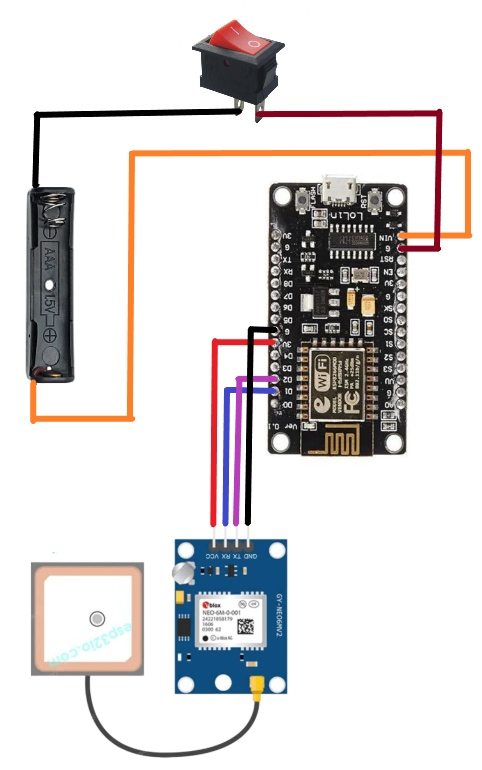

# ESP8266 GPS Code — Smart Blind Stick

This code runs on the **ESP8266** and handles:
- GPS data retrieval
- Wi-Fi connection
- Serving live location data via web interface

## Components Used
- ESP8266 (NodeMCU or ESP-01)
- GPS Module (NEO-6M)

## Pin Connections

| Component     | ESP8266 Pin |
|---------------|-------------|
| GPS TX        | D2 (GPIO4)  |
| GPS RX        | D1 (GPIO5)  |

## Wi-Fi Setup
Edit the following in `gps_tracking.ino`:
```cpp
const char* ssid = "Your-WiFi-Name";
const char* password = "Your-WiFi-Password";
```

## How to Upload

Open gps_tracking.ino in Arduino IDE.

Install the required libraries:
- TinyGPS++
- SP8266WiFi (included with ESP8266 board package)

Select Board: NodeMCU 1.0 (ESP-12E Module)

Select the correct Port from Tools → Port.

Click Upload to program the ESP8266.

## Accessing Location Data

After the ESP8266 boots, open the Serial Monitor in Arduino IDE (set baud rate to 115200).

Wait for the IP address to appear (e.g., 192.168.x.x).

On a device connected to the same Wi-Fi network, open a web browser and enter the IP address.

The web page will display:
- Latitude & Longitude
- Date & Time
- A clickable Google Maps link to the current location

---

## Reference
See `/hardware/schematics/esp8266_pin_diagram.png` for Pin diagram.

<p align="center">
  
</p>